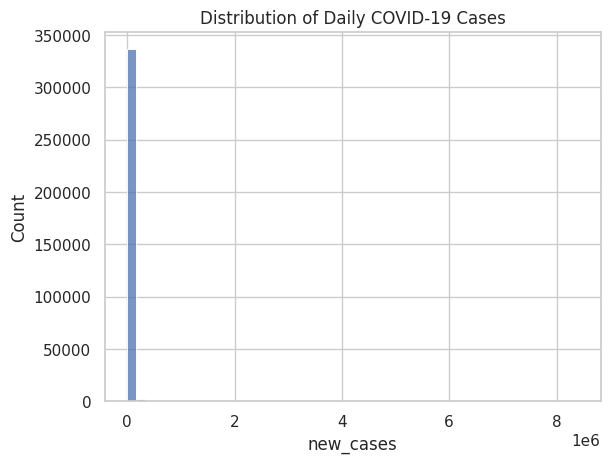

# COVID-19 Data Analysis

This project performs **Exploratory Data Analysis (EDA)** on global COVID-19 data to understand how the pandemic evolved across different countries. The analysis focuses on identifying trends, comparing infection patterns, and visualizing the spread of COVID-19 using Python data analysis tools.

---

## Project Work Done By
**Mahrin Jawwad Arab**  

---

## Dataset

The dataset used in this project is provided by **Our World in Data**, which contains global COVID-19 statistics such as total cases, daily new cases, and deaths for different countries.

Dataset source:  
https://covid.ourworldindata.org/data/owid-covid-data.csv

---

## Project Objectives

- Analyze COVID-19 case trends over time  
- Compare infection patterns across selected countries  
- Identify peak infection periods  
- Calculate death rates to understand the severity of outbreaks  
- Visualize patterns using different charts and graphs  

---

## Visualizations Included 

The project includes multiple visualizations such as:

---

### Daily COVID-19 Cases Trend

This chart shows how daily COVID-19 cases changed over time for selected countries.

---

### 7-Day Rolling Average of Cases

A rolling average smooths fluctuations and highlights major infection waves.

---

### Peak COVID-19 Cases by Country

This bar chart compares the highest number of daily cases recorded in each selected country.

---

### Total Cases Comparison

This visualization compares the total number of COVID-19 cases across selected countries.

---

### COVID-19 Death Rate by Country

This chart shows the calculated death rate based on total deaths and total cases.

---

## Tools & Technologies

- **Python**
- **Pandas** – data manipulation and analysis  
- **Matplotlib** – data visualization  
- **Seaborn** – statistical data visualization  
- **Google Colab / Jupyter Notebook**

---

## Analysis Performed

The following analyses were performed in this project:

- Data inspection and preprocessing  
- Filtering selected countries for comparative analysis  
- Visualization of daily COVID-19 cases  
- Calculation of **7-day rolling averages** to smooth trends  
- Peak case comparison across countries  
- **Death rate calculation** to analyze outbreak severity  
- **Correlation heatmap** to understand relationships between variables  
- Distribution analysis of daily case counts  

---

## Visualizations Included

The project includes multiple visualizations such as:

- Line charts showing daily COVID-19 case trends  
- Rolling average trend graphs  
- Bar charts comparing peak cases across countries  
- Total case comparisons  
- Death rate analysis charts  
- Correlation heatmap  
- Distribution plots  

---

## Key Insights

- COVID-19 cases occurred in multiple waves across different countries.  
- Rolling averages provide a clearer understanding of trends by smoothing daily fluctuations.  
- Different countries experienced peak infection periods at different times.  
- Death rates varied across regions, reflecting differences in healthcare capacity and response.  

---

## Conclusion

This project demonstrates how **exploratory data analysis and visualization techniques** can help uncover patterns in real-world datasets. By analyzing COVID-19 trends across different countries, we gain insights into how the pandemic spread globally and how data analysis can support understanding of major public health events.
